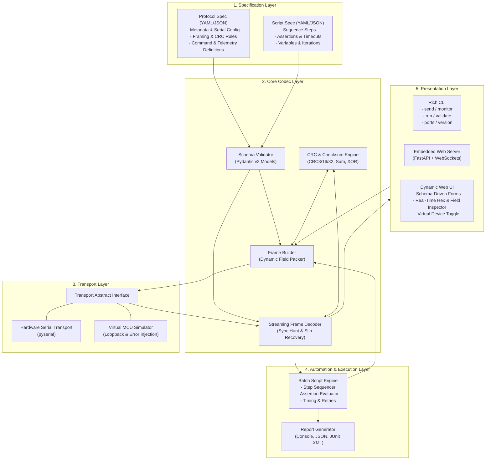
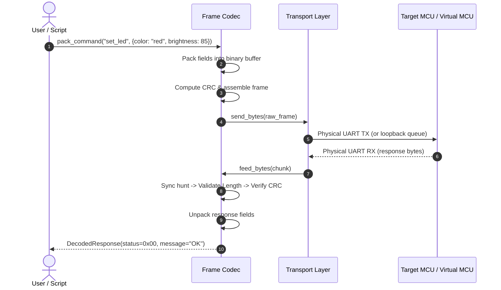

# OmniUART System Architecture

## 1. Executive Summary
**OmniUART** is an extensible, schema-driven UART protocol engineering tool designed for embedded systems engineers, firmware developers, and hardware quality assurance teams. It decouples protocol definitions from tool implementation by using declarative JSON or YAML specifications.

The tool provides three primary execution modes:
1. **Interactive CLI**: Ad-hoc command dispatch, register interrogation, and live decoded protocol sniffing.
2. **Scripted Test Runner**: Deterministic automated batch execution with timeouts, delays, assertions, and structured reporting.
3. **Auto-Generated Web Dashboard**: A zero-install local web interface dynamically generated from the protocol schema, featuring real-time WebSocket packet streaming, interactive parameter controls, and virtual device loopback simulation.

In addition, OmniUART is engineered for **standalone distribution** via PyInstaller single-file executables, requiring no pre-installed Python runtime on client machines.

---

## 2. High-Level Architecture

OmniUART is structured into five decoupled layers:
- **Specification Layer**: Protocol schemas and automation test sequences in JSON or YAML.
- **Core Codec & Framing Layer**: Streaming packet unpacker, dynamic field serializer, byte-alignment and endianness handling, and zero-dependency checksum/CRC engine.
- **Transport Abstraction Layer**: Unifies hardware serial ports (`pyserial`) and in-memory virtual loopback transceivers with programmable MCU responses and error injection.
- **Automation & Execution Layer**: Sequence runner orchestrating commands, evaluating response assertions, and producing structured reports.
- **Presentation Layer**: Typer-based command-line interface and FastAPI/WebSocket dynamic web interface.

[[CAPTION:Figure]] High-level modular architecture of OmniUART.

---

## 3. Subsystem Breakdown

### 3.1 Specification Layer (`omniuart.core.models`)
The specification layer defines the data contracts using Pydantic v2. The schema validates protocol definitions containing:
- **`meta`**: Name, description, protocol version, author, and schema compliance version.
- **`serial_defaults`**: Default baud rate, data bits, parity, stop bits, and timeout.
- **`framing`**:
  - Delimited mode (ASCII tokens with delimiters such as `\r\n` or `STX`/`ETX`) vs Binary frame mode.
  - Sync/Preamble header sequence (e.g. `[0xAA, 0x55]`).
  - Length field offset, size, endianness, and inclusion semantics (payload only vs full frame).
  - Command ID / Opcode field offset and size.
  - Integrity algorithm: `none`, `xor`, `sum8`, `sum16`, `crc8`, `crc16_ccitt`, `crc16_modbus`, `crc32`.
  - Footer / Postamble byte sequence.
- **`commands`**: List of commands with parameterized fields (type, scale, min, max, enums) and expected response definitions.
- **`telemetry`**: Definitions of unsolicited status packets or periodic measurement frames.

### 3.2 Core Codec Layer (`omniuart.core.codec` & `omniuart.core.crc`)
- **Streaming Parser & Sync Hunt**:
  The parser maintains an internal sliding FIFO byte buffer. When incoming data arrives in arbitrary chunks or with noise, the parser scans for the sync sequence, extracts the length field, validates that the entire frame has arrived, verifies the checksum/CRC, and extracts fields into structured dictionaries.
- **Dynamic Field Serialization**:
  Converts user-supplied parameters into binary data using standard `struct` pack/unpack logic according to field specifications (`uint8`, `uint16`, `uint32`, `int8`, `int16`, `int32`, `float32`, `float64`, `bool`, `enum`, `string`, `bytes`, and bitfields).
- **CRC & Integrity Engine**:
  A zero-dependency pure-Python implementation implementing standard polynomial presets (CRC8, CRC16 Modbus/CCITT, CRC32, Sum, XOR) as well as **fully custom parametric CRCs** based on the Rocksoft Parameter Model (`width`, `poly`, `init`, `refin`, `refout`, `xorout`, `endian`).

### 3.3 Transport Abstraction Layer (`omniuart.core.transport`)
All communication occurs through a common asynchronous transport interface:
- **`SerialTransport`**: Interacts with physical COM ports or `/dev/ttyUSB*` devices. Configures hardware flow control (RTS/CTS), software flow control (XON/XOFF), and RS-485 half-duplex direction switching where required.
- **`VirtualTransport`**: An in-memory software loopback transport that simulates target microcontrollers. It features:
  - Configurable lookup table of request/response matching rules.
  - Controllable latency and transmission jitter.
  - Fault injection (CRC corruption, dropped bytes, intermittent timeout) to verify client resilience.

### 3.4 Script Execution Engine (`omniuart.runner.executor`)
Orchestrates automated test scripts defined in YAML or JSON:
- Sequentially dispatches commands with variable substitutions.
- Awaits expected responses within specified timeouts.
- Executes assertions (`==`, `!=`, `<`, `<=`, `>`, `>=`, `in`, `contains`, `tolerance`).
- Implements retry policies and execution control (`abort_on_error`, `continue`).
- Generates test execution summaries in human-readable console tables and machine-readable JSON/JUnit XML formats.

### 3.5 Session Recording & Data Persistence (`omniuart.core.recorder`)
Captures all live serial transactions during ad-hoc sessions, CLI monitoring, or automated script execution:
- **Streaming Session Buffer**: Records chronological event records including microsecond timestamps, direction (`tx` / `rx`), raw byte payloads, decoded command identifiers, unpacked field dictionaries, and CRC validation status.
- **Export Formats**:
  - **JSON Lines (`.jsonl`)**: Structured, line-delimited records suitable for automated parsing, log ingestion, and replay.
  - **Comma-Separated Values (`.csv`)**: Tabular export of timestamps, opcodes, and decoded parameter values for Excel / pandas analysis.
  - **Raw Binary Stream (`.bin`)**: Unmodified raw byte sequence for low-level protocol playback.

### 3.6 Deep Dissection & Diagnostic Debugger (`omniuart.core.dissector`)
Provides comprehensive debugging information on raw and decoded streams:
- **Byte-by-Byte Visual Dissection**: Color-coded categorization separating Header preambles, Length fields, Command IDs, Payload byte slices, CRC checksums, and Footers.
- **CRC Diagnostics**: Explicit debug logs detailing calculated vs received checksums, the exact byte range hashed, and bit-level diffs on mismatch.
- **Sync Hunt Diagnostics**: Logs synchronization acquisitions, byte slip occurrences, discarded noise counts, and incomplete frame buffer states.

### 3.7 Presentation Layer
- **CLI (`omniuart.cli.main`)**: Built with Typer and Rich to provide formatted terminal tables, color-coded logging, and progress bars.
- **Web UI & Server (`omniuart.ui.server`)**: Built with FastAPI and Starlette WebSockets. Emits bidirectional JSON messages containing:
  - Real-time TX and RX packet records with millisecond timestamps and raw hex dumps.
  - Decoded key-value trees.
  - Dynamic forms automatically rendered from the protocol schema.

---

## 4. Data Flow Sequences

### 4.1 Command Dispatch & Response Evaluation (CLI / Script)

[[CAPTION:Figure]] Sequence diagram for command dispatch, framing, and response decoding.

---

## 5. Architectural Quality Attributes

| Attribute | Architectural Mechanism | Verification Target |
| :--- | :--- | :--- |
| **Portability** | PyInstaller single-file packaging; pure-Python core without native binary compilation dependencies. | Runs on clean Windows, Linux, and macOS environments without Python installed. |
| **Robustness** | Streaming sync hunt with sliding FIFO; garbage byte discarding; strict CRC validation. | Recovers framing sync within 1 frame when preceded by 1024 random noise bytes. |
| **Extensibility** | Schema-driven protocol specifications (YAML/JSON); decoupled transport interfaces. | Adding a new custom protocol requires zero changes to the underlying Python codebase. |
| **Testability** | Built-in Virtual Transport with mock responses and fault injection. | Full test suite executable in headless CI environments without physical hardware. |
| **Low Latency** | Async I/O, lookup-table-accelerated CRC calculations, and streaming WebSockets. | Sub-millisecond packet processing overhead in user space. |

[[CAPTION:Table]] Architectural quality attributes and verification targets.
