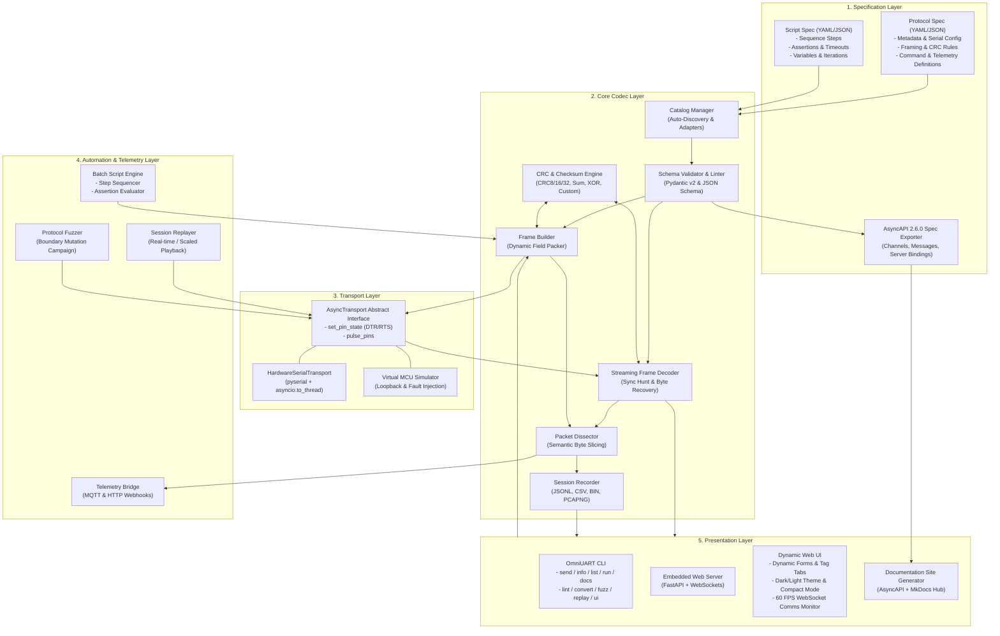

# OmniUART System Architecture

## 1. Executive Summary
**OmniUART** is an extensible, schema-driven UART protocol engineering tool designed for embedded systems engineers, firmware developers, and hardware quality assurance teams. It decouples protocol definitions from tool implementation by using declarative JSON or YAML specifications.

The tool provides three primary execution modes:
1. **Interactive CLI**: Ad-hoc command dispatch, register interrogation, protocol linting, mutation fuzzing, session replay, and live decoded protocol sniffing.
2. **Scripted Test Runner**: Deterministic automated batch sequence execution with timeouts, delays, assertions, and structured reporting.
3. **Auto-Generated Web Dashboard**: A zero-install local web interface dynamically generated from the protocol schema, featuring real-time 60 FPS WebSocket packet streaming, interactive parameter controls, dark/light themes, compact density mode, and virtual device loopback simulation.

In addition, OmniUART is engineered for **standalone distribution** via PyInstaller single-file executables for Windows and Linux, requiring no pre-installed Python runtime on client machines.

---

## 2. High-Level Architecture

OmniUART is structured into five decoupled layers:
- **Specification Layer**: Protocol schemas, AsyncAPI 2.6.0 exports, and automation test sequences in JSON or YAML.
- **Core Codec & Framing Layer**: Streaming packet unpacker, dynamic field serializer, byte-alignment and endianness handling, and zero-dependency checksum/CRC engine.
- **Transport Abstraction Layer**: Unifies hardware serial ports (`pyserial`), async non-blocking execution, and in-memory virtual loopback transceivers with programmable MCU responses, DTR/RTS pin pulsing, and error injection.
- **Automation & Telemetry Layer**: Sequence runner orchestrating commands, Session Replayer, Telemetry Bridge (MQTT/Webhook), and Session Recorder with PCAPNG/JSONL/CSV/BIN exporters.
- **Presentation Layer**: Command-line interface (`omniuart.cli`), AsyncAPI docs builder (`omniuart.docs_generator`), and FastAPI/WebSocket dynamic web interface (`omniuart.ui.app`).

[[CAPTION:Figure]] High-level modular architecture of OmniUART v0.4.0.

---

## 3. Subsystem Breakdown

### 3.1 Catalog Manager & Adapters (`omniuart.core.catalog`)
- **Auto-Discovery**: Scans registered protocol and script directories dynamically. Automatically picks up newly added protocol definition files (`.json`, `.yaml`) or test sequences without code changes.
- **Kit & Sequence Adapters**:
  - `kit_adapter.py`: Converts standard `uart-interface-schema-kit` AsyncAPI protocol definitions into internal `ProtocolSpec` data models.
  - `sequence_adapter.py`: Converts sequence files into `ScriptSpec` models.
- **Security Policy**: Strictly enforces G460 protocol exclusion across all directory scanners.

### 3.2 Core Codec & CRC Engine (`omniuart.core.crc` & `omniuart.core.models`)
- **Pydantic v2 Specifications**: Validates protocol framing rules, preambles, variable-length headers, footers, command parameters, and expected response payloads.
- **Parametric CRC Engine**: Pure-Python zero-dependency implementation supporting standard presets (`crc8`, `crc16_modbus`, `crc16_ccitt`, `crc32`, `sum8`, `sum16`, `xor8`) and custom Rocksoft models (`width`, `poly`, `init`, `refin`, `refout`, `xorout`, `endian`).

### 3.3 Transport Abstraction Layer (`omniuart.core.transport`)
- **`AsyncTransport`**: Abstract interface providing non-blocking `open()`, `close()`, `read()`, `write()`, `set_pin_state()`, and `pulse_pins()`.
- **`HardwareSerialTransport`**: Interacts with physical hardware COM ports using PySerial wrapped in `asyncio.to_thread` for non-blocking I/O. Supports hardware RTS/CTS flow control and DTR/RTS bootloader pin pulsing.
- **`VirtualTransport`**: In-memory software MCU simulator for offline testing. Features configurable rule-based response generation, latency jitter, and fault injection (CRC bit-flip, frame drop rate).

### 3.4 Data Persistence & Session Recorder (`omniuart.core.recorder`)
- **Transaction Buffer**: Thread-safe ring buffer capturing raw byte dumps, timestamps, directions (`tx`/`rx`), decoded payload fields, and CRC integrity status.
- **Multi-Format Exporters**:
  - **JSON Lines (`.jsonl`)**: Machine-readable log ingestion format used for automated auditing and session replaying.
  - **CSV (`.csv`)**: Tabular export for spreadsheet analysis.
  - **Raw Binary (`.bin`)**: Binary payload bytes.
  - **Wireshark PCAPNG (`.pcapng`)**: Standard Wireshark packet capture format with Section Header, Interface Description, and Enhanced Packet Blocks.

### 3.5 Replayer, Telemetry Bridge & Fuzzer
- **`SessionReplayer` (`omniuart.core.replayer`)**: Replays recorded `.jsonl` session transactions onto physical or virtual serial links with real-time or speed-scaled timing.
- **`TelemetryBridge` (`omniuart.core.telemetry`)**: Dispatches parsed UART telemetry events to external HTTP Webhook endpoints and MQTT topics (`omniuart/telemetry/<cmd_name>`).
- **`ProtocolFuzzer` (`omniuart.core.fuzzer`)**: Executes automated boundary mutation campaigns (bit flips, length corruptions, string overflows, integer boundary values) against target MCUs to assess firmware stability.

### 3.6 Presentation & Web UI (`omniuart.cli` & `omniuart.ui.app`)
- **Interactive Web UI**: Zero-dependency FastAPI + WebSockets local web interface. Auto-generates command parameter forms, auto-runs dashboard diagnostics, streams 60 FPS real-time serial traffic, and provides dark/light themes and compact mode.
- **GUI Launch Mode**: Double-clicking `omni-uart-windows-amd64.exe` (or running zero CLI arguments) automatically starts the Web UI server and opens the browser to `http://localhost:8000`.

---

## 4. Architectural Quality Attributes

| Attribute | Architectural Mechanism | Verification Target |
| :--- | :--- | :--- |
| **Portability** | PyInstaller single-file executable packaging; pure-Python core without native compilation dependencies. | Runs on clean Windows and Linux environments without Python installed. |
| **Robustness** | Streaming sync hunt with sliding FIFO; garbage byte discarding; strict CRC validation. | Recovers framing sync within 1 frame when preceded by random noise bytes. |
| **Extensibility** | Declarative JSON/YAML specifications; dynamic catalog auto-discovery; AsyncAPI 2.6.0 exporter. | Adding a new protocol definition requires zero code changes to the underlying Python codebase. |
| **Testability** | Built-in Virtual MCU Transport with mock responses and fault injection. | Full test suite (60+ tests) executable in headless CI environments without physical hardware. |
| **Low Latency** | Async I/O with `asyncio.to_thread`, lookup-table CRC calculation, and 60 FPS WebSockets. | Sub-millisecond packet processing overhead in user space. |
