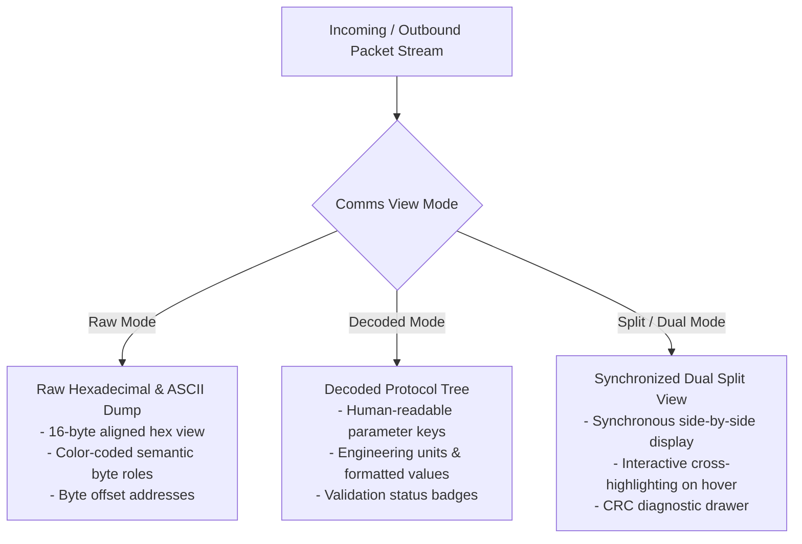

# OmniUART Dynamic Web UI Architecture

## 1. Design Overview
The OmniUART Web UI provides an interactive, schema-driven dashboard that eliminates the need for hardcoded GUI applications for custom UART protocols.

Key characteristics:
- **Zero Frontend Build Dependencies**: Built using modern vanilla ES modules, native Web Components, and modern CSS variables. Running `omni-uart ui` requires no `npm`, `node`, or frontend bundling.
- **Dynamic Form Generation**: The UI reads the protocol schema over a REST endpoint (`/api/protocol`) and automatically synthesizes input widgets tailored to each command's parameters.
- **High-Performance Streaming**: A bidirectional WebSocket (`/ws/serial`) streams raw byte hex dumps and decoded telemetry frames directly to the client at 60 FPS without DOM thrashing.
- **Virtual Device Toggle**: Includes a one-click switch between physical hardware serial ports and the virtual MCU loopback simulator.

---

## 2. Dynamic Form Generation Logic

When a protocol is loaded, the client inspects each command's parameter list and maps types to UI controls:

| Parameter Type | Schema Attributes | Rendered UI Control | Interaction Behavior |
| :--- | :--- | :--- | :--- |
| `uint8`, `int16`, `float32` | `min`, `max`, `step`, `unit` | HTML5 `<input type="number">` or Slider | Bounds validation; units appended in label. |
| `enum` | `options: {0: "OFF", 1: "ON"}` | HTML5 `<select>` dropdown | Displays human-readable label; sends numeric code. |
| `bool` | `default: false` | Toggle switch | Transmits `0` or `1`. |
| `string` | `max_length`, `encoding` | Text box with character counter | Live length enforcement. |
| `bytes` | `length` | Hex-formatted text field (`0x..`) | Auto-formats pairs of hex characters. |

[[CAPTION:Table]] Schema-to-UI control mapping.

---

## 3. UI Component Layout & Comms Panel Architecture

The interface is structured into four primary viewports:
1. **Top Connection & Session Bar**: Serial port picker, baudrate selector, Virtual Loopback toggle, connection status, and session recorder controls.
2. **Left Dynamic Command Panel**: Automatically generated input forms tailored to loaded protocol commands.
3. **Right Communications Panel (Comms Panel)**: Dedicated traffic monitor providing **Raw Data**, **Decoded Data**, and **Split / Dual View** modes.
4. **Bottom Telemetry & Diagnostics Bar**: Real-time sensor metrics, packet counters, and transmission latency graph.

```
+---------------------------------------------------------------------------------+
|  OmniUART [Protocol: SensorNode v1.2]   [Port: COM4 v] [Baud: 115200 v] [CONNECT] |
|  [x] Virtual Loopback Mode    [Traffic: TX 142pkts / RX 140pkts]   [Status: ACTIVE] |
|  SESSION RECORDER: [● START REC] [❚❚ PAUSE]  Frames: 282  Bytes: 3.4KB            |
|                    [EXPORT: JSONL v] [DOWNLOAD RECORDING]                       |
+---------------------------------------------------------------------------------+
|  COMMAND DISPATCH (Dynamic)             |  COMMS PANEL (Raw / Decoded / Split)    |
|                                         |  VIEW: [Raw] [Decoded] [Split (Active)] |
|  Command: [set_threshold          v]    |  FILTER: [All] [TX] [RX]  Search: [   ] |
|  +-----------------------------------+  |  [❚❚ Auto-Scroll] [Clear Log] [Export]  |
|  | Channel:        [ 0             ] |  |-----------------------------------------|
|  | Low Limit:      [ 20.0       °C ] |  | 14:22:01.102 [TX] set_threshold         |
|  | High Limit:     [ 75.0       °C ] |  | RAW:                                    |
|  | Alert Enable:   [ ON (toggle)   ] |  | 0000: [AA 55] [06 00] [12] [00 28 00 4B]|
|  +-----------------------------------+  |       (Sync)  (Len)   (ID) (Payload)    |
|  [ SEND COMMAND ]                       | DECODED:                                |
|                                         |   channel: 0 (uint8)                    |
|                                         |   low_limit: 20.0 °C (float32)          |
|                                         |   high_limit: 75.0 °C (float32)         |
|                                         | DEBUG: CRC16 OK (0x4B8A, bytes 2..8)    |
|                                         |-----------------------------------------|
|                                         | 14:22:01.120 [RX] status_reply          |
|                                         | RAW:                                    |
|                                         | 0000: [AA 55] [02 00] [92] [00] [3C 12] |
|                                         | DECODED:                                |
|                                         |   status: SUCCESS (0)                   |
+-----------------------------------------+-----------------------------------------+
|  TELEMETRY & SENSOR MONITOR (Charts & Live Indicators)                            |
|  Temperature: [ 24.3 °C ]    Humidity: [ 52.1 % ]    Battery: [ 3280 mV ]          |
+---------------------------------------------------------------------------------+
```
[[CAPTION:Figure]] ASCII layout of the auto-generated dynamic web UI featuring the Comms Panel.

### 3.1 Comms Panel View Modes
The Comms Panel supports three switchable presentation modes via the header toggle:


[[CAPTION:Figure]] Comms Panel view mode routing and capabilities.

#### 1. Raw Data Mode (`[Raw]`)
- Displays packets as formatted hexadecimal byte sequences accompanied by an ASCII sidebar.
- Byte offset gutter (`0000:`, `0010:`).
- Semantic color coding across packet slices:
  - **Header Preamble**: Light Blue (`#38bdf8`)
  - **Length Field**: Amber (`#fbbf24`)
  - **Command ID**: Emerald Green (`#34d399`)
  - **Parameter Payload**: Purple (`#c084fc`)
  - **Integrity Checksum/CRC**: Forest Green (`#22c55e` if verified) or Crimson Red (`#ef4444` if invalid)
  - **Footer Postamble**: Slate Gray (`#94a3b8`)

#### 2. Decoded Data Mode (`[Decoded]`)
- Formats incoming and outgoing frames as hierarchical, collapsible object trees.
- Displays field names, primitive types (`uint8`, `float32`, `enum`), decoded engineering values with units (e.g. `24.5 °C`), and human-readable enum labels.
- Timestamp indicators with microsecond resolution and latency delta indicators (`Δ 18ms`).

#### 3. Split / Dual View Mode (`[Split]`)
- Combines Raw and Decoded presentations side-by-side in synchronized split columns.
- **Interactive Cross-Highlighting**:
  - Hovering over a parameter field in the Decoded column instantly highlights its corresponding byte span in the Raw Hex column.
  - Hovering over any byte in the Raw Hex column highlights the field name in the Decoded tree.
- **Packet Detail & CRC Debug Drawer**:
  - Clicking any packet opens an inspection drawer showing:
    - Integrity algorithm: preset name or custom polynomial formula.
    - Expected CRC vs Received CRC.
    - Exact byte range evaluated (`bytes[start:end]`).
    - Bit-level diff on validation error.

### 3.2 Comms Panel Toolbar Controls
| Control Element | Behavior |
| :--- | :--- |
| **View Selector** | Toggles between `Raw`, `Decoded`, and `Split` presentations. |
| **Direction Filter** | Filters display to `All`, `TX Only` (outbound), or `RX Only` (inbound). |
| **Live Search** | Filters frames by opcode name, hex pattern, or parameter value in real time. |
| **Auto-Scroll Lock** | Toggles automatic scrolling on incoming traffic (`[❚❚ Pause]` / `[▶ Follow]`). |
| **Clear Log** | Clears the active display viewport without purging the session recording buffer. |
| **Export View** | One-click export of currently filtered frames to JSONL or CSV. |

[[CAPTION:Table]] Comms Panel control actions.

---

## 4. WebSocket Protocol Specification

The WebSocket connection (`ws://127.0.0.1:8080/ws/serial`) exchanges structured JSON messages:

### 4.1 Client-to-Server Messages
- **`connect`**: `{ "action": "connect", "port": "COM3", "baudrate": 115200, "virtual": false }`
- **`disconnect`**: `{ "action": "disconnect" }`
- **`send_command`**: `{ "action": "send_command", "command": "set_threshold", "params": {"channel": 0, "low_limit": 20.0} }`
- **`send_raw`**: `{ "action": "send_raw", "hex": "AA550100" }`
- **`start_record`**: `{ "action": "start_record", "session_name": "thermal_run_1" }`
- **`stop_record`**: `{ "action": "stop_record" }`
- **`export_session`**: `{ "action": "export_session", "format": "jsonl" | "csv" | "bin" }`

### 4.2 Server-to-Client Messages
- **`packet_event`**:
  ```json
  {
    "type": "packet",
    "timestamp": 1726950121.102,
    "direction": "rx",
    "raw_hex": "AA 55 06 00 12 00 28 00 4B 8A",
    "command_id": "0x12",
    "command_name": "temperature_report",
    "crc_valid": true,
    "crc_details": {
      "algorithm": "crc16_modbus",
      "expected": "0x4B8A",
      "received": "0x4B8A",
      "byte_range": [2, 8]
    },
    "fields": {
      "channel": 0,
      "temperature": 24.5
    },
    "slices": [
      {"role": "header", "start": 0, "end": 2},
      {"role": "length", "start": 2, "end": 4},
      {"role": "command_id", "start": 4, "end": 5},
      {"role": "payload", "start": 5, "end": 9},
      {"role": "crc", "start": 9, "end": 11}
    ]
  }
  ```
- **`status_event`**: `{ "type": "status", "connected": true, "port": "COM3", "recording": true, "packet_count": 282, "error": null }`
- **`session_export`**: `{ "type": "session_export", "format": "jsonl", "filename": "session_20260921.jsonl", "data": "..." }`
