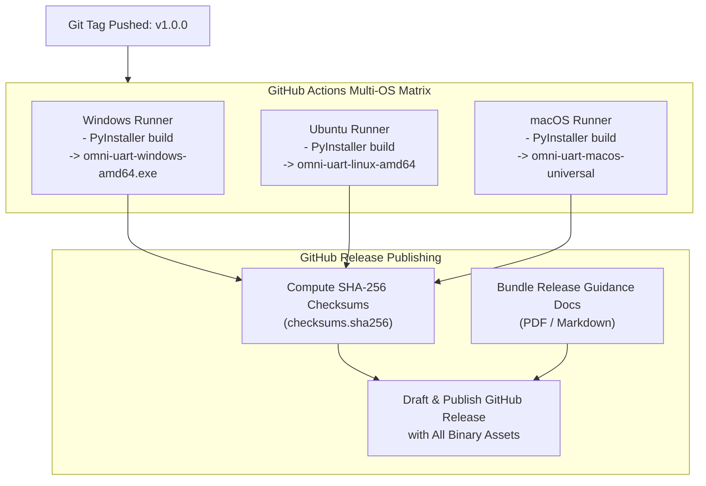

# OmniUART Standalone Packaging & Distribution Design

## 1. Objective & Requirements
OmniUART is authored in modern Python (3.12+), but must be distributed as a **self-contained standalone executable** for end users:
- **No Python runtime required**: End users do not need Python, `pip`, or virtual environments installed on their host systems.
- **Single-binary execution**: One executable file containing the Python interpreter, bundled C-extensions (`pyserial`), dependencies (`pydantic`, `uvicorn`, `fastapi`, `rich`, `typer`), and embedded web static assets.
- **Multi-platform support**: Native standalone binaries generated for:
  - Windows (`x86_64`): `omni-uart-windows-amd64.exe`
  - Linux (`x86_64`): `omni-uart-linux-amd64`
  - macOS (`Universal / arm64`): `omni-uart-macos-universal`

---

## 2. Bundling Technology Selection: PyInstaller

**PyInstaller** is selected for standalone compilation because:
1. It supports dynamic introspection of packages and dependencies.
2. It generates clean `--onefile` compressed executables.
3. It seamlessly integrates into automated GitHub Actions multi-OS runner matrices (`windows-latest`, `ubuntu-latest`, `macos-latest`).

---

## 3. Runtime Asset Resolution (`sys._MEIPASS`)

When bundled with `--onefile`, PyInstaller extracts static assets into a temporary directory tracked by `sys._MEIPASS`. OmniUART provides a central resource resolver:

```python
import sys
from pathlib import Path

def get_bundle_dir() -> Path:
    """Return the absolute path to resource directory, handling PyInstaller onefile mode."""
    if getattr(sys, "frozen", False) and hasattr(sys, "_MEIPASS"):
        return Path(sys._MEIPASS)
    return Path(__file__).resolve().parent.parent

def get_static_asset_path(relative_path: str) -> Path:
    """Resolve an internal static asset path (e.g. schemas, UI templates)."""
    return get_bundle_dir() / relative_path
```
[[CAPTION:Figure]] Resource path resolution for PyInstaller standalone runtime.

---

## 4. PyInstaller Specification (`omniuart.spec`)

The build specification bundles:
- The CLI entry point (`omniuart.cli.main`).
- Hidden imports for Uvicorn async event loops (`uvicorn.loops.auto`, `uvicorn.protocols.http.auto`, `uvicorn.protocols.websockets.auto`).
- Data directories: `schemas/`, `src/omniuart/ui/static/`, and default `examples/`.

```python
# -*- mode: python ; coding: utf-8 -*-
import sys
from pathlib import Path
from PyInstaller.utils.hooks import collect_data_files, collect_submodules

block_cipher = None

datas = [
    ('schemas', 'schemas'),
    ('src/omniuart/ui/static', 'omniuart/ui/static'),
    ('examples', 'examples'),
]

hiddenimports = [
    'uvicorn.logging',
    'uvicorn.loops',
    'uvicorn.loops.auto',
    'uvicorn.protocols',
    'uvicorn.protocols.http',
    'uvicorn.protocols.http.auto',
    'uvicorn.protocols.websockets',
    'uvicorn.protocols.websockets.auto',
    'pydantic',
    'pydantic_core',
    'serial',
    'yaml',
]

a = Analysis(
    ['src/omniuart/cli/main.py'],
    pathex=[],
    binaries=[],
    datas=datas,
    hiddenimports=hiddenimports,
    hookspath=[],
    runtime_hooks=[],
    excludes=['tkinter', 'matplotlib', 'scipy', 'numpy'],
    win_no_prefer_redirects=False,
    win_private_assemblies=False,
    cipher=block_cipher,
    noarchive=False,
)

pyz = PYZ(a.pure, a.zipped_data, cipher=block_cipher)

exe = EXE(
    pyz,
    a.scripts,
    a.binaries,
    a.zipfiles,
    a.datas,
    [],
    name='omni-uart',
    debug=False,
    bootloader_ignore_signals=False,
    strip=False,
    upx=True,
    upx_exclude=[],
    runtime_tmpdir=None,
    console=True,
    disable_windowed_traceback=False,
    target_arch=None,
    codesign_identity=None,
    entitlements_file=None,
)
```
[[CAPTION:Figure]] PyInstaller build specification (`omniuart.spec`).

---

## 5. Automated GitHub Release Pipeline

The build and release lifecycle is triggered whenever a version tag (`v*.*.*`) is pushed:


[[CAPTION:Figure]] Multi-platform standalone binary release pipeline.

### 5.1 Release Asset Package
Every GitHub Release contains:
1. `omni-uart-windows-amd64.exe`
2. `omni-uart-linux-amd64.tar.gz`
3. `omni-uart-macos-universal.tar.gz`
4. `checksums.sha256` (Cryptographic verification checksums)
5. `RELEASE_GUIDANCE.md` (Self-contained user guide and protocol examples)
