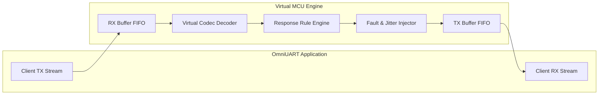

# OmniUART Transport Layer & Virtual MCU Design

## 1. Architectural Purpose
The Transport Layer decouples byte-level serialization and message parsing from physical input/output mechanisms. It defines an abstract asynchronous transport interface fulfilled by two primary implementations:
1. **`SerialTransport`**: Communicates with physical serial interfaces (USB-UART bridges, FTDI chips, native RS-232/RS-485 ports).
2. **`VirtualTransport`**: An in-memory mock microcontroller simulator that allows offline protocol development, dynamic UI testing, and automated continuous integration without hardware attached.

---

## 2. Abstract Transport Interface

All transports implement the `AsyncTransport` contract:

```python
class AsyncTransport(ABC):
    @abstractmethod
    async def open(self) -> None:
        """Establish connection to the physical port or initialize virtual buffers."""
        pass

    @abstractmethod
    async def close(self) -> None:
        """Release port resources cleanly."""
        pass

    @abstractmethod
    async def write(self, data: bytes) -> int:
        """Transmit raw bytes to the endpoint."""
        pass

    @abstractmethod
    async def read(self, max_bytes: int = 4096) -> bytes:
        """Asynchronously read available incoming bytes."""
        pass

    @property
    @abstractmethod
    def is_open(self) -> bool:
        """Indicate whether the transport is active."""
        pass
```
[[CAPTION:Figure]] Transport interface definition.

---

## 3. Physical Serial Transport (`SerialTransport`)

### 3.1 Serial Port Management
The physical serial transport wraps `pyserial` with an asynchronous worker task:
- Non-blocking async queue decoupling: An internal background reader thread reads from the OS serial descriptor into an `asyncio.Queue` to prevent blocking the event loop.
- Dynamic port discovery: Enumerates connected devices using `serial.tools.list_ports`, returning manufacturer, serial number, and product VID/PID for user selection.
- Flow control support: Hardware RTS/CTS, software XON/XOFF, and DTR toggle for target microcontroller reboot.

### 3.2 RS-485 Half-Duplex Operation
For RS-485 transceivers requiring Direction Control (DE/RE pins):
- Custom RTS toggle before and after write operations.
- Settling delay configuration (pre-transmission and post-transmission guard times) to prevent bus collisions.

---

## 4. Virtual MCU Loopback Engine (`VirtualTransport`)

The Virtual MCU simulator makes OmniUART completely self-contained for tests and offline development.


[[CAPTION:Figure]] Virtual MCU loopback architecture.

### 4.1 Response Rule Engine
The virtual engine matches incoming command opcodes and returns predetermined responses defined in the protocol:
- **Automatic Echo / Ping Response**: Automatically responds to standard discovery/ping opcodes.
- **Stateful Memory Bank**: Stores simulated device registers (e.g. `set_temperature` updates a virtual sensor register; subsequent `get_temperature` queries return the updated value).
- **Simulated Latency**: Configurable response delay (e.g. 5ms to 50ms) to model real-world microcontroller processing intervals.

### 4.2 Fault & Resilience Injection
For automated reliability testing, the virtual device can inject realistic bus disturbances:
- **Corrupted CRC**: Bit-flips checksum bytes with a configurable probability (e.g. 10% corrupted frames) to test client frame rejection.
- **Byte Dropping**: Truncates frames mid-payload to verify stream synchronization recovery.
- **Intermittent Timeouts**: Simulates firmware lockups by withholding responses.
- **Preamble Noise**: Injects random garbage bytes between frames to verify sync hunt resilience.
