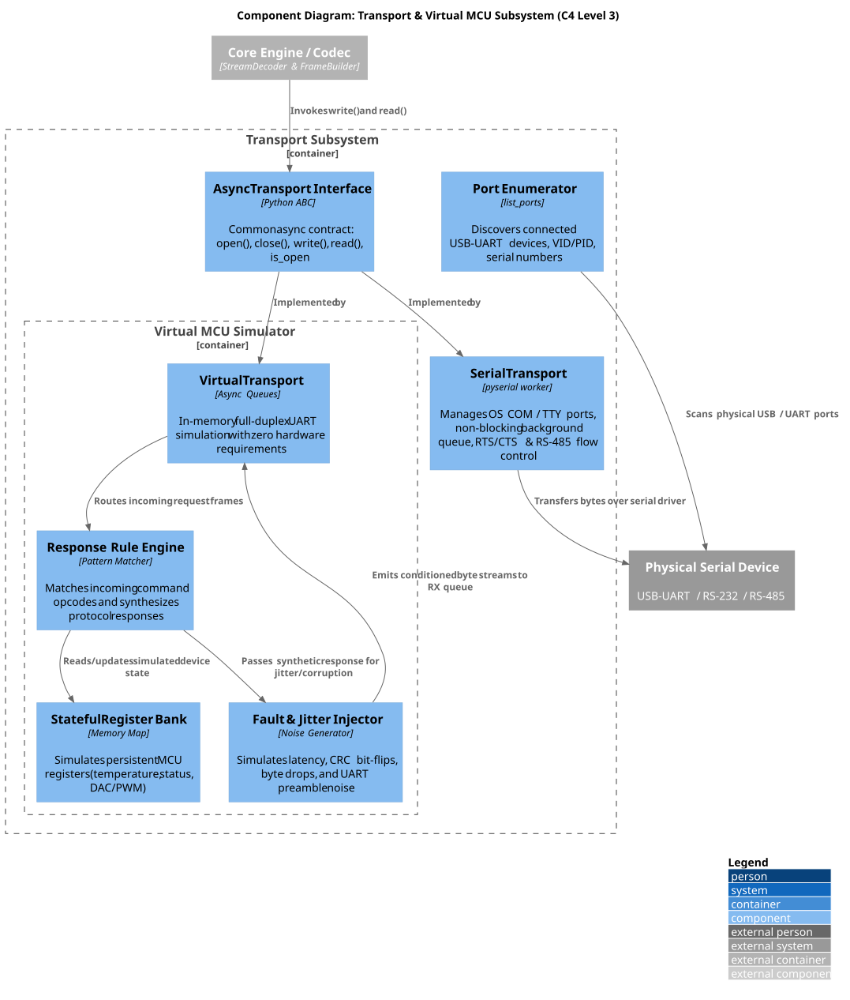
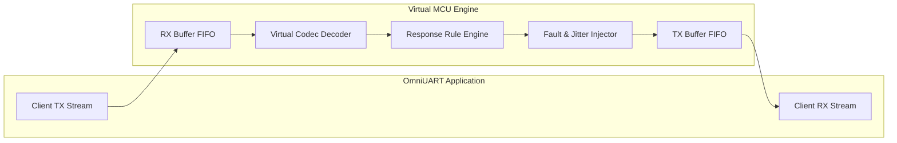
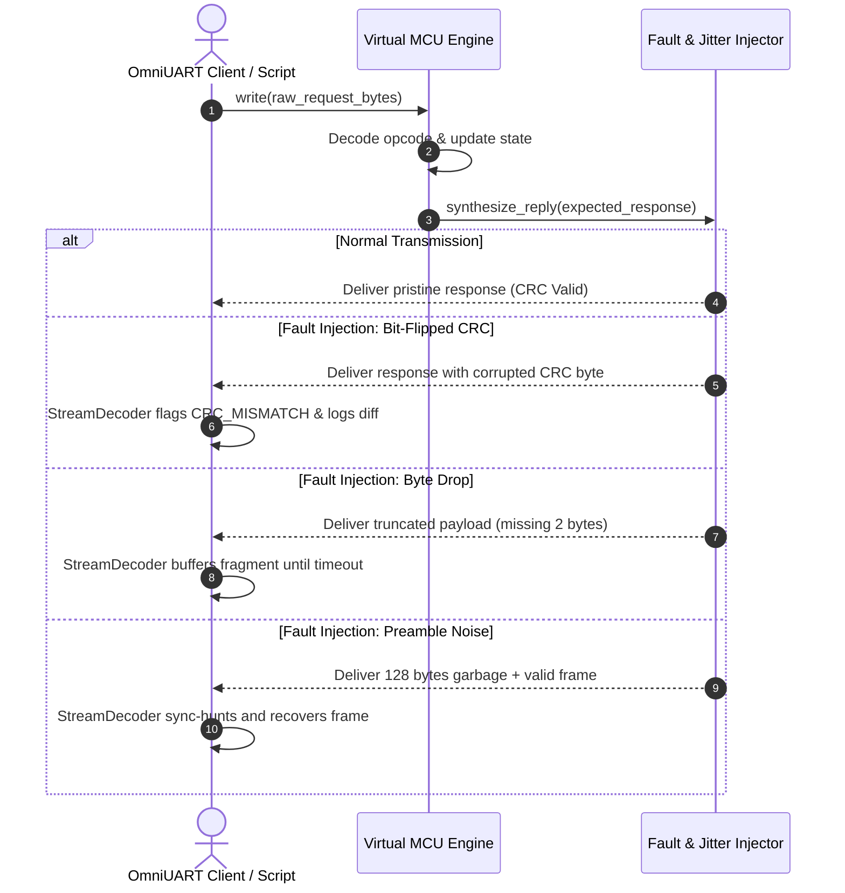

# OmniUART Transport Layer & Virtual MCU Design

## 1. Architectural Purpose
The Transport Layer decouples byte-level serialization and message parsing from physical input/output mechanisms. It defines an abstract asynchronous transport interface fulfilled by two primary implementations:
1. **`SerialTransport`**: Communicates with physical serial interfaces (USB-UART bridges, FTDI chips, native RS-232/RS-485 ports).
2. **`VirtualTransport`**: An in-memory mock microcontroller simulator that allows offline protocol development, dynamic UI testing, and automated continuous integration without hardware attached.

---

## 2. Abstract Transport Interface

All transports implement the `AsyncTransport` contract:

```python
class AsyncTransport(ABC):
    @abstractmethod
    async def open(self) -> None:
        """Establish connection to the physical port or initialize virtual buffers."""
        pass

    @abstractmethod
    async def close(self) -> None:
        """Release port resources cleanly."""
        pass

    @abstractmethod
    async def write(self, data: bytes) -> int:
        """Transmit raw bytes to the endpoint."""
        pass

    @abstractmethod
    async def read(self, max_bytes: int = 4096) -> bytes:
        """Asynchronously read available incoming bytes."""
        pass

    @property
    @abstractmethod
    def is_open(self) -> bool:
        """Indicate whether the transport is active."""
        pass
```
[[CAPTION:Figure]] Transport interface definition.

---

## 3. Physical Serial Transport (`SerialTransport`)

### 3.1 Serial Port Management
The physical serial transport wraps `pyserial` with an asynchronous worker task:
- Non-blocking async queue decoupling: An internal background reader thread reads from the OS serial descriptor into an `asyncio.Queue` to prevent blocking the event loop.
- Dynamic port discovery: Enumerates connected devices using `serial.tools.list_ports`, returning manufacturer, serial number, and product VID/PID for user selection.
- Flow control support: Hardware RTS/CTS, software XON/XOFF, and DTR toggle for target microcontroller reboot.

### 3.2 RS-485 Half-Duplex Operation
For RS-485 transceivers requiring Direction Control (DE/RE pins):
- Custom RTS toggle before and after write operations.
- Settling delay configuration (pre-transmission and post-transmission guard times) to prevent bus collisions.

### 3.3 PTY Transport (Linux and macOS)
`PtyTransport` is a real, event-loop driven transport over a POSIX pseudo-terminal descriptor, and `PtySerialPair` allocates a linked master/slave pair:
- **Endpoints**: `PtySerialPair().host` is the master side and `.device` the slave side. `slave_pts_path` (for example `/dev/pts/7`) is the slave device node, which other programs, or `HardwareSerialTransport`, can open like a serial port. `PtyTransport(path=...)` opens such a node itself.
- **Raw I/O**: Descriptors are switched to raw, non-blocking mode (no echo, no newline translation) and read through `loop.add_reader`, with no worker threads. Writes larger than the kernel buffer wait for the reader instead of failing.
- **Timeouts**: `read(size, timeout_ms)` returns the bytes that arrived within the timeout (possibly none); `timeout_ms=None` waits forever and `0` polls.
- **Lifecycle and errors**: Operations on a closed transport raise `RuntimeError`; `close()` is idempotent. When the other end goes away, buffered bytes are still delivered, later reads return `b""` immediately, `peer_closed` becomes true and writes raise `ConnectionError`.
- **Pins**: A pty has no DTR/RTS lines; `set_pin_state` is accepted and ignored.

### 3.4 Windows Named-Pipe Transport
`WindowsNamedPipeTransport` connects to a genuine Windows named pipe (`\\\\.\\pipe\\<name>`) using overlapped I/O on the asyncio Proactor event loop, so it interoperates with other processes (terminal emulators, hypervisor virtual COM ports, another OmniUART instance) and never blocks the loop:
- **Roles**: `role="server"` creates the pipe on `open()` and serves the first client (`wait_connected()` waits for it); `role="client"` connects on `open()`, retrying while the server is starting or busy for up to `connect_timeout_s`, then raising `ConnectionError`. `WindowsNamedPipePair` runs both ends in one process for tests.
- **Timeouts and partial reads**: `read(size, timeout_ms)` returns the bytes that arrived within the timeout (possibly none); `timeout_ms=None` waits forever and `0` polls.
- **Back-pressure**: `write` waits while the pipe's write buffer is full.
- **Lifecycle and errors**: Operations on a closed transport raise `RuntimeError`; `close()` is idempotent; `write` without a connected peer raises `ConnectionError`. When the peer disconnects, buffered bytes are still delivered, later reads return `b""` immediately, `peer_closed` becomes true and writes raise `ConnectionError`.
- **Platform**: Windows only. Constructing it elsewhere raises `NotImplementedError`; use `PtyTransport` on Linux and macOS.

---

## 4. Virtual MCU Loopback Engine (`VirtualTransport`)

The Virtual MCU simulator makes OmniUART completely self-contained for tests and offline development:


[[CAPTION:Figure]] C4 Level 3: Transport & Virtual MCU Component Diagram.


```mermaid
flowchart LR
    subgraph Host["OmniUART Application"]
        TX[Client TX Stream]
        RX[Client RX Stream]
    end

    subgraph VirtualMCU["Virtual MCU Engine"]
        InQueue[RX Buffer FIFO]
        Decoder[Virtual Codec Decoder]
        RuleEngine[Response Rule Engine]
        FaultInjector[Fault & Jitter Injector]
        OutQueue[TX Buffer FIFO]
    end

    TX --> InQueue
    InQueue --> Decoder
    Decoder --> RuleEngine
    RuleEngine --> FaultInjector
    FaultInjector --> OutQueue
    OutQueue --> RX
```
[[CAPTION:Figure]] Virtual MCU loopback internal pipeline.

### 4.1 Response Rule Engine
Both `VirtualTransport` (given a protocol) and `BaseDeviceSimulator` identify requests with the protocol's `FrameCodec`. No byte offsets or response layouts are hard-coded:
- **Request parsing**: Requests are located in the byte stream by header, length and footer, validated against the integrity field, and matched to a command by its ID. Frames split across writes are reassembled, and several frames in one write each get an answer.
- **Schema-built responses**: A command that declares a `response` is answered with a frame built from that definition (response ID, field order, endianness and integrity). Response fields use their declared `default`, else the smallest legal value.
- **Silence is a valid answer**: Frames with a bad integrity value, an unknown ID, a malformed payload or a command without a `response` are not answered, like a real device. `BaseDeviceSimulator` counts them in `rx_errors`.
- **Explicit behaviour**: Subclasses override `BaseDeviceSimulator.handle_command(cmd, params)` to return response field values (or `None` to stay silent), which is how stateful devices are modelled. `VirtualTransport.register_response(command_id, raw_bytes)` registers a fixed raw reply for a command ID.
- **No protocol**: `VirtualTransport()` without a protocol is a plain loopback that echoes written bytes.
- **Simulated Latency**: Configurable response delay (e.g. 5ms to 50ms) to model real-world microcontroller processing intervals.

### 4.2 Fault & Resilience Injection
For automated reliability testing, the virtual device can inject realistic bus disturbances:
- **Corrupted CRC**: Bit-flips checksum bytes with a configurable probability (e.g. 10% corrupted frames) to test client frame rejection.
- **Byte Dropping**: Truncates frames mid-payload to verify stream synchronization recovery.
- **Intermittent Timeouts**: Simulates firmware lockups by withholding responses.
- **Preamble Noise**: Injects random garbage bytes between frames to verify sync hunt resilience.


```mermaid
sequenceDiagram
    autonumber
    actor Client as OmniUART Client / Script
    participant Virtual as Virtual MCU Engine
    participant Fault as Fault & Jitter Injector

    Client->>Virtual: write(raw_request_bytes)
    Virtual->>Virtual: Decode opcode & update state
    Virtual->>Fault: synthesize_reply(expected_response)
    alt Normal Transmission
        Fault-->>Client: Deliver pristine response (CRC Valid)
    else Fault Injection: Bit-Flipped CRC
        Fault-->>Client: Deliver response with corrupted CRC byte
        Client->>Client: StreamDecoder flags CRC_MISMATCH & logs diff
    else Fault Injection: Byte Drop
        Fault-->>Client: Deliver truncated payload (missing 2 bytes)
        Client->>Client: StreamDecoder buffers fragment until timeout
    else Fault Injection: Preamble Noise
        Fault-->>Client: Deliver 128 bytes garbage + valid frame
        Client->>Client: StreamDecoder sync-hunts and recovers frame
    end
```
[[CAPTION:Figure]] Sequence diagram for Virtual MCU fault and jitter injection.
